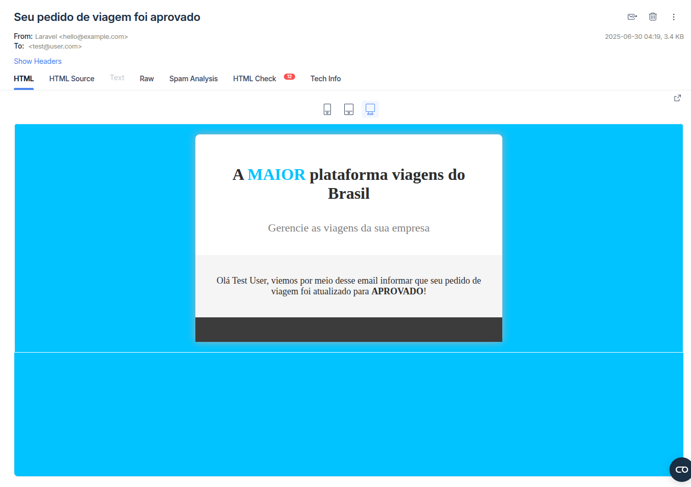
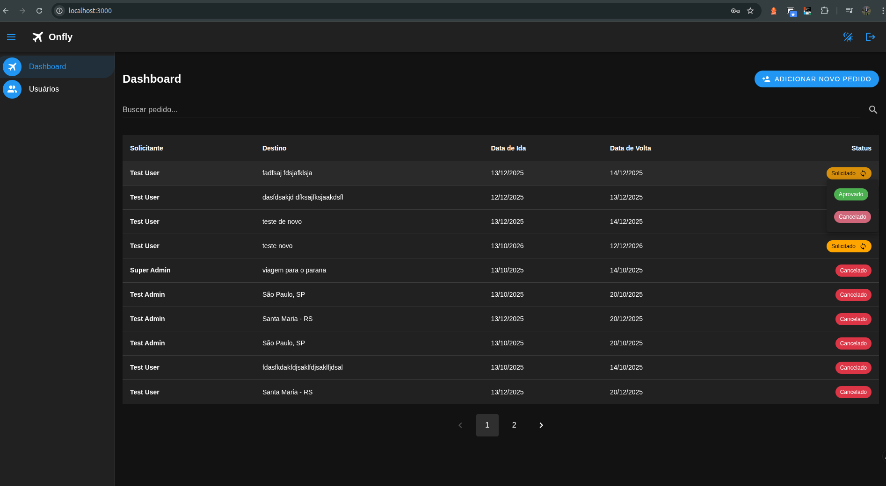

# 🚀 Onfly Test - Sistema de Gestão de Viagens Corporativas

> **Aplicação Full Stack** desenvolvida em Laravel (API REST) + Vue.js (Frontend) para gerenciamento de pedidos de viagem corporativa.

---

## 📋 Índice

- [🚀 Execução Rápida](#-execução-rápida)
- [📖 Descrição do Projeto](#-descrição-do-projeto)
- [🏗️ Arquitetura](#️-arquitetura)
- [⚙️ Configuração e Instalação](#️-configuração-e-instalação)
- [🧪 Testes](#-testes)
- [📚 Documentação da API](#-documentação-da-api)
- [🎯 Funcionalidades](#-funcionalidades)
- [📁 Estrutura do Projeto](#-estrutura-do-projeto)
- [🤝 Contribuição](#-contribuição)

---

## 🚀 Execução Rápida

### Pré-requisitos
- Docker e Docker Compose instalados
- Git

### Passos para Execução
```bash
# 1. Clone o repositório
git clone https://github.com/reichert-lucas/onfly-test.git
cd onfly-test

# 2. Execute com Docker Compose
docker compose up
```

**Acesso:**
- **Frontend:** http://localhost:3000
- **Backend API:** http://localhost:8000

---

## 📖 Descrição do Projeto

Sistema completo para **gestão de pedidos de viagem corporativa** que permite aos usuários:

- ✅ Criar e gerenciar pedidos de viagem
- ✅ Consultar histórico de pedidos
- ✅ Aprovar/rejeitar pedidos (administradores)
- ✅ Receber notificações de status
- ✅ Autenticação segura

---

## 🏗️ Arquitetura

```
┌─────────────────┐    ┌─────────────────┐    ┌─────────────────┐
│   Frontend      │    │   Backend       │    │   Database      │
│   (Vue.js)      │◄──►│   (Laravel)     │◄──►│   (MySQL)       │
│   Port: 3000    │    │   Port: 8000    │    │   Port: 3306    │
└─────────────────┘    └─────────────────┘    └─────────────────┘
```

---

## ⚙️ Configuração e Instalação

### 1. Variáveis de Ambiente

#### Backend (Laravel)
```env
# .env
DB_CONNECTION=mysql
DB_HOST=mysql
DB_PORT=3306
DB_DATABASE=onfly_test
DB_USERNAME=root
DB_PASSWORD=password

# importante adicionar os dados do servidor de email para que sejam disparadas as notificações 
MAIL_MAILER=smtp
MAIL_HOST=sandbox.smtp.mailtrap.io
MAIL_PORT=2525
MAIL_USERNAME=***************
MAIL_PASSWORD=***************
MAIL_ENCRYPTION=null
MAIL_FROM_ADDRESS="hello@example.com"
MAIL_FROM_NAME="${APP_NAME}"
```

#### Frontend (Vue.js)
```env
# .env
NUXT_PUBLIC_API_BASE_URL=http://localhost:8000/api
```

### 2. Configuração do Banco de Dados
```bash
# Execute as migrações
docker docker exec onfly-api php artisan migrate

# Execute os seeders (opcional)
docker docker exec onfly-api php artisan db:seed
```


### 3. Configuração do Servidor de Email

#### Configuração do Mailtrap (Desenvolvimento)

Deve ser adicionado os dados de algum servidor de e-mails para que seja possível o disparo de e-mails com a notificação de alteração de status de pedidos.


#### Exemplo de E-mail de Aprovação


#### Exemplo da tela de pedidos com os botões de alteração de pedido. Vale salientar, que para os botões aparecer o usuário deve estar logado com um usuário administrador, além disso, ele não pode ter realizado o pedido (deve ser um pedido de outro usuário). 


#### Exemplo de Filtragem de Pedidos


---

### 4. Usuários Criados Automaticamente

O sistema cria automaticamente alguns usuários para facilitar os testes:

#### Usuários Administradores
- **Super Admin:**
  - Email: `super@admin.com`
  - Senha: `password`
  - Permissões: Acesso total aos sistemas

- **Admin:**
  - Email: `test@admin.com`
  - Senha: `password`
  - Permissões: Gerenciamento de pedidos de viagem dos usuários do sistema, e dos usuários do sistema.

#### Usuários Comuns
- **Usuário Teste:**
  - Email: `test@user.com`
  - Senha: `password`
  - Permissões: Criar e visualizar próprios pedidos

## 🧪 Testes

### Executar Testes do Backend
```bash
# Todos os testes
docker docker exec onfly-api php artisan test

# Testes específicos
docker docker exec onfly-api php artisan test --filter=AuthTest
```

### Cobertura de Testes
- ✅ Testes de Autenticação
- ✅ Testes de Sistema
- ✅ Testes de Funcionalidades

---

## 📚 Documentação da API

### Documentação Postman
A documentação completa das rotas da API está disponível através da **Collection do Postman** localizada no diretório principal do projeto:

📁 **`postman-documentation.json`**

Esta collection contém todas as rotas da API organizadas por funcionalidade:
- 🔐 **Autenticação** - Login, logout e gerenciamento de tokens
- 👥 **Usuários** - CRUD de usuários e perfis
- 🏢 **Sistemas** - Gerenciamento de sistemas e escopos
- ✈️ **Pedidos de Viagem** - Criação, consulta e alteração de status

**Como usar:**
1. Importe o arquivo `.json` no Postman
2. Configure as variáveis de ambiente (base_url, token)
3. Teste as rotas diretamente na interface do Postman
4. Ao efetuar login, o token já é adicionado nas variáveis de ambiente, ou seja, basta executar as outras rotas 👍

---

## 🎯 Funcionalidades

### 🔐 Sistema de Autenticação
- **Login/Logout**
- **Proteção de rotas** por middleware
- **Diferentes níveis** de acesso (usuário, admin, super admin)
- **Proteção por Global Scopes** fazendo com que usuários só vejam as coisas que são deles, ou de seus sistemas.

### 👥 Gestão de Usuários
- **CRUD completo** de usuários
- **Busca e filtros** avançados
- **Validação** de dados

### 🏢 Gestão de Sistemas
- **Múltiplos sistemas** por usuário
- **Escopo de sistema** automático
- **Seleção de sistema** ativo

### 🎨 Interface Moderna
- **Design responsivo** com Vuetify
- **Temas claro/escuro**
- **Notificações toast**
- **Modais interativos**

---

## 📁 Estrutura do Projeto

```
onfly-test/
├── 📁 api/                    # Backend Laravel
│   ├── 📁 app/
│   │   ├── 📁 Controllers/    # Controladores da API
│   │   ├── 📁 Models/         # Modelos Eloquent
│   │   ├── 📁 Services/       # Serviços de negócio
│   │   └── 📁 Middleware/     # Middlewares customizados
│   ├── 📁 database/
│   │   ├── 📁 migrations/     # Migrações do banco
│   │   └── 📁 seeders/        # Dados iniciais
│   └── 📁 tests/              # Testes automatizados
├── 📁 front/                  # Frontend Nuxt.js
│   ├── 📁 components/         # Componentes Vue
│   ├── 📁 pages/              # Páginas da aplicação
│   ├── 📁 stores/             # Gerenciamento de estado
│   └── 📁 composables/        # Composables reutilizáveis
└── 📄 docker-compose.yml      # Configuração Docker
```

---

## 🤝 Contribuição

### Como Contribuir

1. **Fork** o projeto
2. **Crie** uma branch para sua feature (`git checkout -b feature/AmazingFeature`)
3. **Commit** suas mudanças (`git commit -m 'Add some AmazingFeature'`)
4. **Push** para a branch (`git push origin feature/AmazingFeature`)
5. **Abra** um Pull Request

### Padrões de Código

- **PSR-12** para PHP
- **ESLint + Prettier** para JavaScript/TypeScript
- **Commits** seguindo Conventional Commits
- **Testes** para novas funcionalidades


<div align="center">

**Desenvolvido para o desafio Onfly Test**

[](https://laravel.com)
[](https://vuejs.org)
[](https://docker.com)

</div>